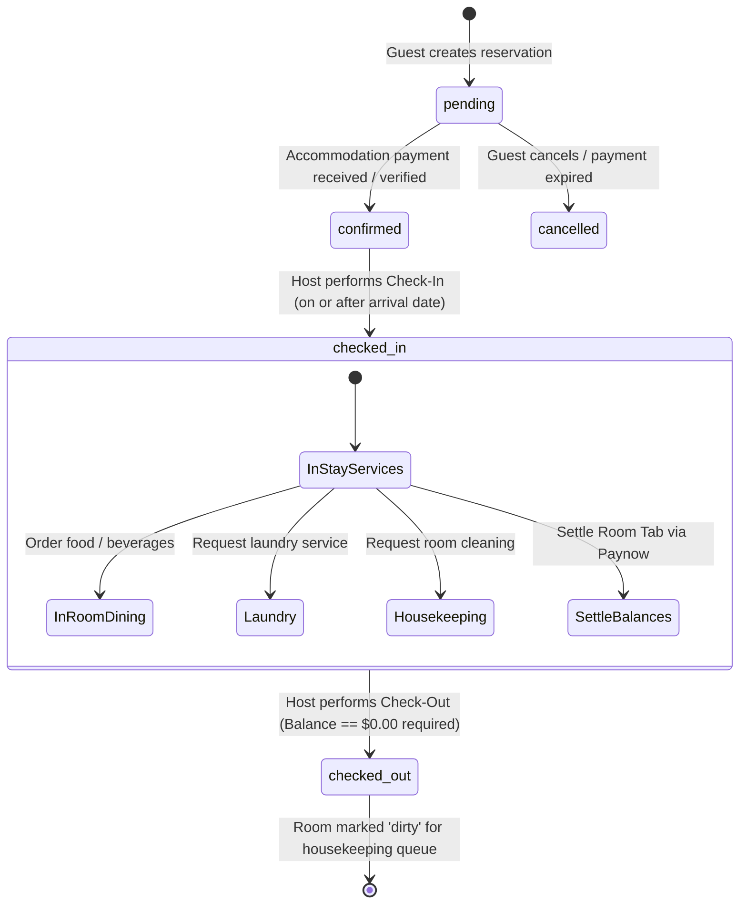
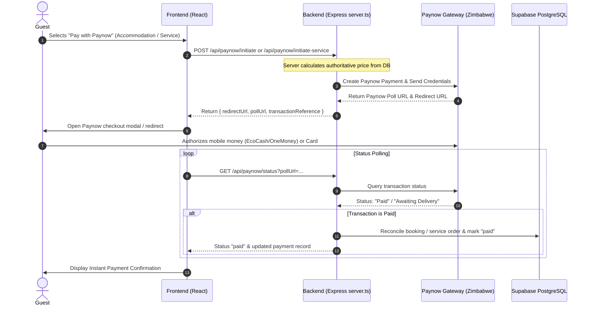
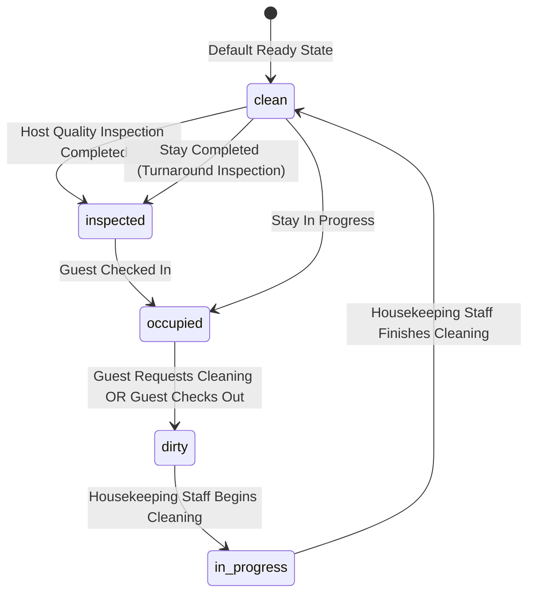
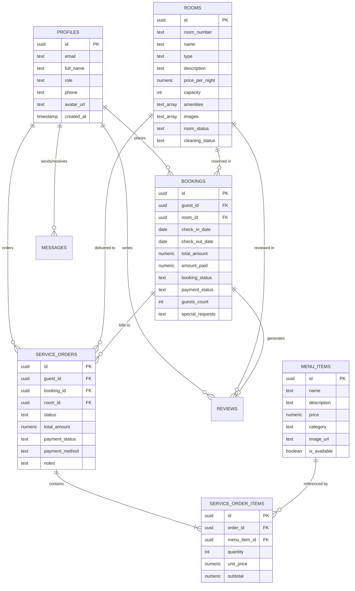
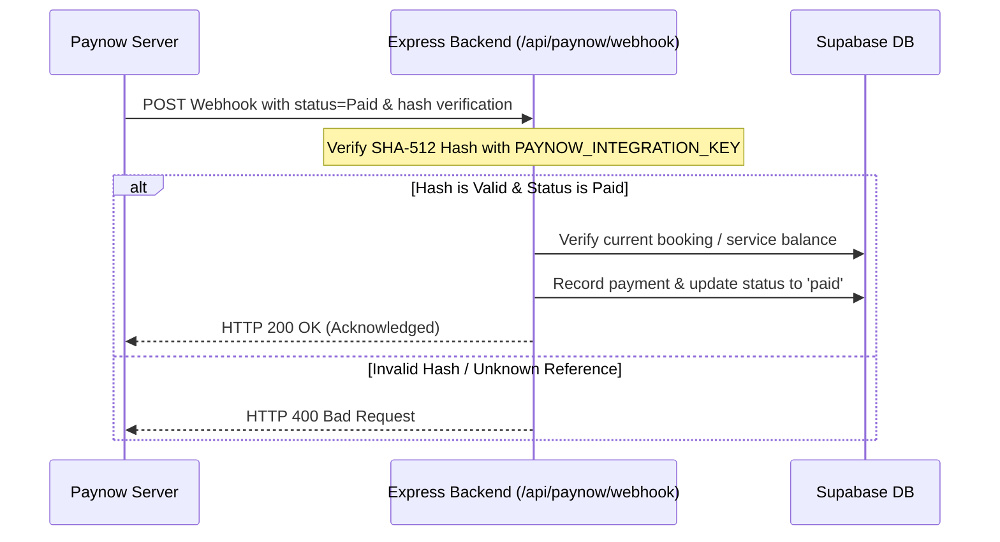

# The Haven Guest House — Full-Stack Hospitality Management & Guest Experience Platform

A modern, production-grade hospitality management system designed to coordinate the end-to-end guest lifecycle, front-desk host operations, housekeeping turnaround, in-room service ordering, folio accounting, and Paynow payment gateway settlement.

---

## 1. Project Overview

**The Haven Guest House** is a full-stack web platform built for boutique accommodation providers. Rather than operating merely as an online room-booking catalog, the application unifies all operational, financial, and logistical facets of hospitality into a single coordinated system:

- **Guest Lifecycle Management**: Real-time room availability discovery, date-bound reservations, check-in validation, digital key/room hub, and balance-gated checkout.
- **Operational Front Desk (Host)**: Reservation inspection, suite allocation, guest check-in/check-out execution, room service tracking, and visual analytics.
- **Housekeeping & Turnover**: Dedicated housekeeping workspace for cleaning status tracking (`dirty`, `in_progress`, `clean`, `inspected`) with zero financial data exposure.
- **In-Room Services & Dining**: Authoritative catalog for breakfasts, meals, snacks, beverages, and laundry services with dual billing modes (*Pay Now via Paynow* or *Charge to Room Tab*).
- **Consolidated Guest Folio**: Real-time balance calculation combining accommodation charges, incidentals, room service orders, and payments received.
- **Secure Financial Settlement**: Integration with Zimbabwe's **Paynow** payment gateway with server-authoritative price verification, transaction reference reconciliation, and idempotency protection.
- **Role-Filtered Real-time Notifications**: Event-driven notification dispatch ensuring staff and guests only receive messages pertinent to their operational domain.

---

## 2. Key Features

```
                               ┌──────────────────────────────────────────────────────────┐
                               │                 The Haven Guest House                    │
                               └────────────────────────────┬─────────────────────────────┘
                                                            │
                 ┌──────────────────────────────────────────┼─────────────────────────────────────────┐
                 ▼                                          ▼                                         ▼
       ┌───────────────────┐                      ┌───────────────────┐                     ┌───────────────────┐
       │   Guest Portal    │                      │    Host Portal    │                     │Housekeeping Portal│
       └─────────┬─────────┘                      └─────────┬─────────┘                     └─────────┬─────────┘
                 │                                          │                                         │
  • Suite Discovery & Booking              • Reservation Operations                  • Room Turnover Queue
  • Check-in / Stay Dashboard              • Front Desk Check-in / Out               • Cleaning State Updates
  • Paynow Accommodation Checkout          • Financial Folio Reconciliations         • Zero Financial Data Leakage
  • Dining & Laundry Room Orders           • Housekeeping Inspection & Audit         • Urgent Turnover Alerts
  • Room Tab / Immediate Paynow            • Service Order Fulfillment               • Ready-for-Guest Handover
  • Post-Check-in Cleaning Requests        • Analytics & Occupancy Reports
  • Folio Balance Settlement               • Real-Time Guest Messaging
```

### Guest Features
- **Account & Profile Management**: Self-registration, secure authentication, personal profile data, and booking history.
- **Interactive Suite Showcase**: Filter by capacity, suite tier (Executive, Deluxe, Garden, Standard), and browse high-resolution photography and amenities.
- **Date-Range Availability Engine**: Conflict-free date selection preventing overlapping reservations.
- **Paynow Accommodation Payment**: Immediate online settlement via EcoCash, OneMoney, or Visa/Mastercard with server-side transaction polling.
- **Active Stay Welcome Hub**: Once checked in, guests unlock suite Wi-Fi credentials, air conditioning/entertainment guidance, host direct messaging, and local Harare recommendations.
- **Digital In-Room Dining & Services**:
  - Full menu categorized into *Breakfast*, *Meals*, *Snacks*, *Beverages*, and *Laundry Services*.
  - Flexible settlement: **Pay Now** (via Paynow) or **Add to Room Tab** (charged to folio).
- **Post-Check-in Housekeeping Requests**: Flag room as needing housekeeping directly from the stay dashboard (restricted until physical check-in).
- **Interactive Digital Folio**: Detailed breakdown of accommodation, service orders, payments recorded, and real-time outstanding balance.
- **Guest Feedback & Reviews**: Post-stay rating and review submission.

### Host / Administrative Features
- **Host Operations Dashboard**: High-level KPIs (total revenue, active bookings, occupancy rate, pending service orders, and cleaning queues).
- **Comprehensive Booking Management**: Search, filter by status, view guest contact details, modify dates, and enforce check-in/out protocols.
- **Folio Audit & Payment Reconciliation**: Real-time breakdown of accommodation fees vs. room-service charges, manual payment recording, and balance auditing.
- **Room Inventory Control**: Real-time room availability status toggles (`available`, `occupied`, `maintenance`, `cleaning`) and pricing configurations.
- **Service Order Dispatch**: Live monitoring of pending dining and laundry orders with status progression (`pending` &rarr; `in_progress` &rarr; `completed` &rarr; `cancelled`).
- **Housekeeping Inspection**: Verify cleaned suites and promote cleaning status to `inspected` or mark as ready for check-in.
- **Guest Communications**: Centralized messaging inbox for guest inquiries.
- **Occupancy & Revenue Analytics**: Recharts-powered revenue trajectories, occupancy distributions, and service category breakdowns.

### Housekeeping Features
- **Dedicated Staff Portal**: Streamlined, high-contrast mobile-friendly view tailored for turnover personnel.
- **Turnaround Status Management**: Toggle suites between `dirty`, `in_progress`, `clean`, and `inspected`.
- **Role Isolation**: Housekeeping staff have zero access to financial records, guest payments, room pricing, or host revenue data.
- **Cleaning Queue Filters**: Instantly isolate dirty suites following guest checkouts or guest-initiated cleaning requests.

---

## 3. Booking Lifecycle & Business Rules



### Core Business Rules Enforced in Codebase

1. **Check-In Date Guard**: Guests cannot be checked in prior to their scheduled `check_in_date`.
2. **Post-Check-In Service Restriction**: Room service and laundry ordering is strictly restricted to guests with an active `checked_in` booking status. Unchecked guests are blocked at both UI and server API levels.
3. **Post-Check-In Cleaning Restriction**: Guests cannot dispatch room cleaning requests before physical check-in.
4. **Checkout Balance Gate**: A guest **cannot** be checked out if an outstanding balance exists on either accommodation or un-settled room services/tabs. The system calculates:
   $$\text{Total Outstanding} = (\text{Accommodation Total} - \text{Accommodation Paid}) + \sum (\text{Active Service Total} - \text{Service Paid})$$
   Checkout is blocked if $\text{Total Outstanding} > \$0.01$.
5. **Cancelled Order Financial Exclusion**: Cancelled service orders are strictly excluded from folio balance obligations and cannot accept payment.
6. **Failed Payment Isolation**: Failed Paynow transactions are flagged as `failed` or `unpaid` and are **never** converted into room tab obligations without explicit guest selection.

---

## 4. Payment System & Paynow Integration

All payment initiation, verification, and status reconciliation happen **server-side** via Express endpoints in `server.ts` to protect Paynow integration secrets.



### Key Security & Operational Characteristics
- **Server-Authoritative Pricing**: The client cannot alter prices or totals sent to Paynow. The backend queries `rooms` or `menu_items` directly to compute the official charge.
- **Idempotency & Duplicate Prevention**: Transactions track distinct references (`TXN-BK-...` and `TXN-SVC-...`). If a payment webhook or poll is processed multiple times, database triggers and server logic verify prior payment to prevent double-crediting.
- **Dual Flow Support**:
  - **Accommodation**: Direct updates to `bookings.amount_paid` and `bookings.payment_status`.
  - **Room Services**: Records in internal payment registry and updates `service_orders.payment_status` to `paid`.

---

## 5. Room Services & Dining System

The Haven Guest House features a digital in-room ordering system:

| Service Category | Sample Offerings | Supported Billing |
| :--- | :--- | :--- |
| **Breakfast** | Full English Breakfast, Continental Basket, Sunrise Omelette | Paynow or Room Tab |
| **All-Day Dining** | Grilled Sirloin Steak, Flame-Grilled Chicken, Victoria Falls Bream, Pasta | Paynow or Room Tab |
| **Snacks & Light Fare** | Gourmet Beef Burger, Toasted Club Sandwich, Samosa Platter | Paynow or Room Tab |
| **Beverages** | Fresh Fruit Juices, Cappuccino/Espresso, Local & Imported Beers, Wine | Paynow or Room Tab |
| **Laundry Services** | Same-Day Wash & Fold, Executive Shirt Pressing, Suit Dry Cleaning | Paynow or Room Tab |

### Dual Payment Modes
1. **Pay Now**: Generates an immediate Paynow checkout session. If the guest abandons or fails payment, the order remains `unpaid`/`failed` and is **not** pushed onto the room tab.
2. **Add to Room Tab**: Adds the verified cost directly to the guest's folio to be settled prior to or at departure.

---

## 6. Guest Folio & Financial Accounting

The guest folio aggregates all financial transactions across a guest's stay into a unified balance sheet.

$$\mathbf{Outstanding\ Balance} = (\text{Room Charge} - \text{Room Paid}) + \sum_{\text{Active Orders}} (\text{Order Total} - \text{Order Paid})$$

### Folio Rules Table
| Transaction Type | Included in Balance Due? | Impact on Checkout |
| :--- | :---: | :--- |
| **Confirmed Accommodation (Unpaid Balance)** | Yes | Blocks checkout until paid |
| **Room Tab Service Orders** | Yes | Blocks checkout until paid |
| **Paynow Service Order (Status: `paid`)** | No ($0 due) | Cleared for checkout |
| **Paynow Service Order (Status: `pending`/`unpaid`)** | Yes | Must be paid or cancelled before checkout |
| **Service Order (Status: `cancelled`)** | No ($0 due) | Does not block checkout |

---

## 7. Role-Based Notification Architecture

Notifications are managed via `NotificationContext.tsx` with role-based routing filters:

- **Guest Channel**: Booking confirmations, payment receipts, room service status alerts, and host replies.
- **Host Channel**: New reservations, guest check-in/out alerts, payment confirmations, service requests, and staff updates.
- **Housekeeping Channel**: Immediate alerts when a suite is marked `dirty` (via checkout or guest request) or moved to `in_progress`. **Strictly isolated from financial/payment notifications.**

---

## 8. Housekeeping & Room Turnaround Workflow



- **Room Status** (`rooms.room_status`): Operational availability (`available`, `occupied`, `maintenance`, `cleaning`).
- **Cleaning Status** (`rooms.cleaning_status`): Hygiene condition (`clean`, `dirty`, `in_progress`, `inspected`).
- **Staff Safeguards**: Cleaning personnel are restricted to updating hygiene statuses and cannot alter pricing, room configurations, or guest folios.

---

## 9. Authentication & Role-Based Access Control (RBAC)

The application enforces three distinct system roles:

| Role | Target Users | Permissions & Scope |
| :--- | :--- | :--- |
| `guest` | Registered guests | Search rooms, create bookings, view personal stays, order room services (checked-in only), request cleaning (checked-in only), pay via Paynow, view personal folio. |
| `host` | Property managers & front desk | Manage all bookings, perform check-in/check-out, inspect room cleaning, manage room inventory & pricing, fulfill room service orders, access financial analytics. |
| `cleaning_staff` | Housekeeping team | Dedicated mobile turnaround dashboard, update cleaning statuses (`dirty` &rarr; `in_progress` &rarr; `clean`), receive cleaning task dispatches. No access to financial data. |

---

## 10. Security Architecture

- **Supabase Authentication**: Secure session persistence with JSON Web Tokens (JWT).
- **PostgreSQL Row Level Security (RLS)**: Policies enforce data isolation across `profiles`, `bookings`, `service_orders`, and `messages`.
- **Zero Client Credential Exposure**: Sensitive keys (`PAYNOW_INTEGRATION_KEY`, `SUPABASE_SERVICE_ROLE_KEY`) are exclusively referenced in `server.ts`.
- **Authoritative Backend Validation**: Room pricing, menu pricing, check-in date rules, and folio balances are validated server-side.
- **Double-Booking Prevention**: Date-range overlap checks in SQL/API prevent conflicting reservations for the same suite.

---

## 11. Technology Stack

### Frontend
- **React 19** (`react` `^19.0.1`, `react-dom` `^19.0.1`): Declarative component architecture.
- **TypeScript 5.8** (`typescript` `~5.8.2`): Strict end-to-end type safety.
- **Vite 6** (`vite` `^6.2.3`): High-performance client bundling.
- **Tailwind CSS 4** (`tailwindcss` `^4.1.14`, `@tailwindcss/vite` `^4.1.14`): Utility-first styling.
- **Motion** (`motion` `^12.23.24`): Smooth UI transitions and modals.
- **Lucide React** (`lucide-react` `^0.546.0`): Icon set.
- **Recharts** (`recharts` `^3.10.1`): Host analytics visualization.
- **Canvas Confetti** (`canvas-confetti` `^1.9.4`): Check-in / payment completion delight states.
- **HTML2Canvas** (`html2canvas` `^1.4.1`): Printable reservation vouchers and folio receipts.

### Backend & Middleware
- **Node.js 22** (`@types/node` `^22.14.0`) with **Express 4** (`express` `^4.21.2`): RESTful API server.
- **TSX** (`tsx` `^4.21.0`): Development TypeScript server runtime.
- **esbuild** (`esbuild` `^0.25.0`): Server-side production bundling.
- **Paynow Node SDK** (`paynow` `^2.2.2`): Zimbabwe Paynow gateway interface.

### Database & Storage
- **Supabase** (`@supabase/supabase-js` `^2.112.3`): Managed PostgreSQL database with real-time subscriptions, RLS policies, and Auth engine.

---

## 12. Project Structure

```
├── .env.example                     # Environment variable definitions template
├── index.html                       # HTML entry point
├── metadata.json                    # Application metadata and runtime permissions
├── package.json                     # NPM dependencies and build scripts
├── server.ts                        # Express backend, Paynow endpoints, Vite middleware
├── tsconfig.json                    # TypeScript compiler configuration
├── vite.config.ts                   # Vite + Tailwind CSS plugin configuration
│
└── src/
    ├── App.tsx                      # Root component, router & view state controller
    ├── main.tsx                     # React root DOM mounting
    ├── index.css                    # Global Tailwind CSS imports
    ├── types.ts                     # TypeScript data contracts, interfaces & enums
    │
    ├── components/                  # React UI Components
    │   ├── Navbar.tsx               # Responsive navigation with role indicators & cart
    │   ├── LandingPage.tsx          # Public homepage with hero & quick search
    │   ├── RoomsCatalog.tsx         # Searchable suite catalog with filter pills
    │   ├── RoomDetailModal.tsx      # Detailed suite modal with amenity specifications
    │   ├── BookingCalendar.tsx      # Date-range availability calendar
    │   ├── BookingModal.tsx         # Reservation creation and checkout modal
    │   ├── FeaturedOffers.tsx       # Curated promotional packages
    │   ├── ReservationPrintModal.tsx# Printable PDF/voucher confirmation modal
    │   │
    │   ├── admin/                   # Host Portal Components
    │   │   ├── HostDashboard.tsx    # High-level operational overview & quick actions
    │   │   ├── HostBookings.tsx     # Reservation management, check-in / check-out
    │   │   ├── HostRooms.tsx        # Room inventory, rate & availability manager
    │   │   ├── HostRoomService.tsx  # In-room dining & laundry order fulfillment
    │   │   ├── HostPayments.tsx     # Financial folio audit & transaction records
    │   │   ├── HostCleaning.tsx     # Housekeeping inspection & readiness review
    │   │   ├── HostMessages.tsx     # Host guest communication portal
    │   │   ├── HostVisualizations.tsx # Financial & occupancy Recharts analytics
    │   │   └── HostSystemTools.tsx  # Operational maintenance & database integrity tools
    │   │
    │   ├── guest/                   # Guest Portal Components
    │   │   ├── GuestDashboard.tsx   # Guest stay hub & consolidated folio review
    │   │   ├── GuestWelcomeLanding.tsx # Checked-in active stay welcome dashboard
    │   │   ├── GuestBookings.tsx    # Reservation history & voucher download
    │   │   ├── GuestBookingDetail.tsx # Detailed stay breakdown
    │   │   ├── GuestRoomService.tsx # In-room dining & laundry ordering interface
    │   │   ├── GuestProfile.tsx     # User personal information management
    │   │   ├── GuestMessages.tsx    # Direct messaging thread with host
    │   │   └── GuestReviewModal.tsx # Post-stay feedback submission
    │   │
    │   ├── cleaning/                # Housekeeping Portal Components
    │   │   ├── CleaningDashboard.tsx # Mobile-optimized room turnaround queue
    │   │   └── CleaningStaffLogin.tsx# Dedicated staff authentication interface
    │   │
    │   ├── payment/                 # Payment Modal Components
    │   │   ├── PaynowPaymentModal.tsx       # Accommodation Paynow modal
    │   │   └── PaynowServicePaymentModal.tsx# Room service Paynow modal
    │   │
    │   ├── auth/                    # Authentication Components
    │   │   └── AuthModal.tsx        # Sign-in / registration modal with role selection
    │   │
    │   ├── notifications/           # Notification Center
    │   │   └── NotificationCenter.tsx # Role-filtered alerts drawer
    │   │
    │   └── ui/                      # Shared UI Primitives
    │       └── Toast.tsx            # Floating notification toasts
    │
    ├── context/                     # React Context Providers
    │   ├── AuthContext.tsx          # User session, role state & sign-in methods
    │   └── NotificationContext.tsx  # Role-based notification dispatcher
    │
    ├── data/                        # Static Domain Data
    │   └── localRecommendations.ts  # Harare local dining & attractions catalog
    │
    └── lib/                         # Core Utilities & API Wrappers
        ├── api.ts                   # Authoritative Supabase API service layer
        ├── supabase.ts              # Supabase client initialization & fallback config
        └── images.ts                # Curated imagery & avatar fallbacks
```

---

## 13. Database Schema & Entities

The platform uses a relational PostgreSQL database on Supabase.



### Enumeration Types
- `UserRole`: `'guest' | 'host' | 'cleaning_staff'`
- `RoomStatus`: `'available' | 'occupied' | 'maintenance' | 'cleaning'`
- `CleaningStatus`: `'clean' | 'dirty' | 'in_progress' | 'inspected'`
- `BookingStatus`: `'pending' | 'confirmed' | 'checked_in' | 'checked_out' | 'cancelled'`
- `PaymentStatus`: `'pending' | 'partial' | 'paid' | 'refunded' | 'failed'`
- `OrderStatus`: `'pending' | 'in_progress' | 'completed' | 'cancelled'`
- `ServicePaymentStatus`: `'unpaid' | 'paid' | 'room_tab' | 'pending' | 'failed' | 'cancelled'`

---

## 14. Installation & Local Development

### Prerequisites
- **Node.js**: v20.x or v22.x LTS
- **NPM**: v10.x+
- **Supabase Account** (or local Supabase instance)
- **Paynow Zimbabwe Account** (for live payment processing)

### Setup Steps

1. **Clone the repository and install dependencies**:
   ```bash
   git clone <repository-url>
   cd the-haven-guest-house
   npm install
   ```

2. **Configure Environment Variables**:
   Copy the example environment configuration:
   ```bash
   cp .env.example .env
   ```
   Fill in your Supabase credentials and Paynow integration details (see Section 15).

3. **Start the Development Server**:
   ```bash
   npm run dev
   ```
   The application will start on `http://localhost:3000` with Express backend and Vite middleware active.

4. **Verify TypeScript & Linting**:
   ```bash
   npm run lint
   ```

5. **Create Production Build**:
   ```bash
   npm run build
   ```
   *Compiles client assets via Vite and creates the single-file Node server in `dist/server.cjs` via esbuild.*

6. **Run Production Server**:
   ```bash
   npm start
   ```

---

## 15. Environment Variables Reference

| Variable Name | Scope | Description | Safe for Frontend? |
| :--- | :--- | :--- | :---: |
| `VITE_SUPABASE_URL` | Frontend & Server | Supabase project URL | Yes |
| `VITE_SUPABASE_ANON_KEY` | Frontend & Server | Supabase public anonymous API key | Yes |
| `SUPABASE_SERVICE_ROLE_KEY` | Server ONLY | Supabase administrative service role key | **NO (Keep Secret)** |
| `PAYNOW_INTEGRATION_ID` | Server ONLY | Paynow Merchant Integration ID | **NO (Keep Secret)** |
| `PAYNOW_INTEGRATION_KEY` | Server ONLY | Paynow Merchant Secret Integration Key | **NO (Keep Secret)** |
| `PAYNOW_RESULT_URL` | Server ONLY | Webhook result URL called by Paynow | **NO (Keep Secret)** |
| `PAYNOW_RETURN_URL` | Server ONLY | Browser redirect URL following Paynow completion | **NO (Keep Secret)** |
| `PAYNOW_AUTH_EMAIL` | Server ONLY | Registered Paynow merchant email (mobile push) | **NO (Keep Secret)** |
| `GEMINI_API_KEY` | Server ONLY | Google Gemini API key (optional smart features) | **NO (Keep Secret)** |
| `APP_URL` | Server ONLY | Canonical public URL of the deployed application | No |

---

## 16. Paynow Callback & Webhook Flow



---

## 17. Testing & Quality Assurance

### Automated Validation Commands
- **Type Checking**:
  ```bash
  npm run lint
  ```
- **Production Build Verification**:
  ```bash
  npm run build
  ```

### Manual Test Scenarios

1. **Guest Booking & Paynow Payment**:
   - Register a guest account &rarr; Browse Executive Suite &rarr; Select future dates &rarr; Initiate Paynow checkout &rarr; Complete payment &rarr; Verify status changes to `confirmed`.
2. **Early Check-In Guard**:
   - Sign in as Host &rarr; Locate a confirmed reservation with a tomorrow check-in date &rarr; Click Check-In &rarr; Verify system rejects early check-in.
3. **Pre-Check-In Service Order Guard**:
   - Sign in as a Guest with a `confirmed` (not checked-in) stay &rarr; Visit Room Service &rarr; Attempt to add items or view cart &rarr; Verify banner indicates services unlock after check-in.
4. **Active Stay Room Ordering & Room Tab**:
   - Check in guest &rarr; As guest, order breakfast choosing *Add to Room Tab* &rarr; Verify order appears on guest dashboard and host room service queue.
5. **Checkout Outstanding Balance Gate**:
   - As host, attempt to check out a guest with an unsettled Room Tab &rarr; Verify checkout is blocked with an explicit balance due alert.
6. **Room Service Paynow Settlement & Checkout**:
   - As guest or host, settle the room service balance &rarr; Attempt checkout again as host &rarr; Verify checkout succeeds and suite is moved to `dirty` cleaning status.
7. **Housekeeping Turnaround**:
   - Sign in as `cleaning_staff` &rarr; Locate dirty suite &rarr; Mark `in_progress` then `clean` &rarr; As host, inspect room and mark `inspected`/`available`.

---

## 18. Test Accounts

> For test credentials and role-specific demo accounts, see `TEST_ACCOUNTS.md`.

*(Default development configurations include sample accounts for `guest`, `host`, and `cleaning_staff` roles to facilitate end-to-end evaluation).*

---

## 19. Demo Walkthrough

1. **Explore Suites**: As a new guest, explore The Haven's suites, amenities, and available dates.
2. **Book & Settle**: Create a reservation and complete payment through the Paynow integration modal.
3. **Host Arrival Check-In**: Host verifies the booking and executes Check-In on the scheduled arrival date.
4. **Guest Active Stay Hub**: Guest unlocks Wi-Fi details, room guidance, and host messaging.
5. **Order In-Room Dining & Laundry**: Guest orders dining items using the *Room Tab* folio option.
6. **Request Cleaning**: Guest flags suite for housekeeping; housekeeping dashboard immediately updates with a turnaround card.
7. **Staff Turnover**: Cleaning staff claims suite, cleans, and marks it `clean`. Host inspects and marks `inspected`.
8. **Folio Audit**: Guest reviews the consolidated financial folio showing room fees and dining tabs.
9. **Final Settlement**: Guest settles remaining tab balance via Paynow.
10. **Check-Out Execution**: Host successfully executes Check-Out with a $0.00 balance, automatically queuing the room for the next turnover.

---

## 20. Technical Highlights

- **Full Booking Lifecycle Engine**: Robust state machine governing reservations from creation to turnover.
- **Server-Authoritative Pricing & Accounting**: Immune to client tampering; all rates and totals are calculated against the database.
- **Strict Role-Based Data Isolation**: Zero financial or private guest data leakage into housekeeping views.
- **Financial Folio Reconciliation**: Seamless aggregation of multi-category charges (lodging, dining, laundry, incidentals).
- **Paynow Payment Integration**: Production-ready transaction polling and server-side verification.
- **Double-Booking & Balance Guards**: Prevents date collisions and enforces departure settlement before checkout.

---

## 21. Future Roadmap

- [ ] **Automated PDF Email Invoices**: Direct email dispatch of tax invoices and folio receipts via SendGrid/Resend.
- [ ] **Multi-Property Management**: Multi-tenancy support for operators managing multiple guest house locations.
- [ ] **Inventory & Stock Depletion Tracking**: Automatic ingredient and linen inventory tracking upon room service fulfillment.
- [ ] **Staff Shift Scheduling**: Housekeeping shift allocation and performance metrics tracking.
- [ ] **Native Mobile Application**: Dedicated iOS/Android builds using React Native or Capacitor.

---

## 22. License

This project is proprietary software developed for **The Haven Guest House**. All rights reserved.
